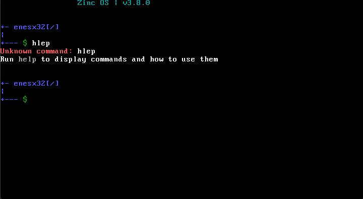
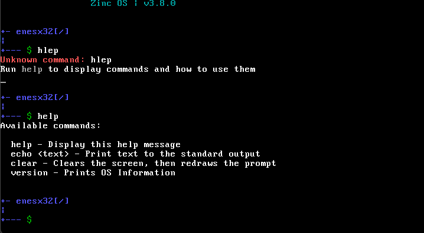

# Zinc OS Examples

## Unknown command

If the user types an unknown command, the following will be displayed:

## Help

By typing `help` into the terminal you will get this responce:

## Version

And by entering `version` you will get a colourful  
interface displaying stuff like os, kernel, shell and more

